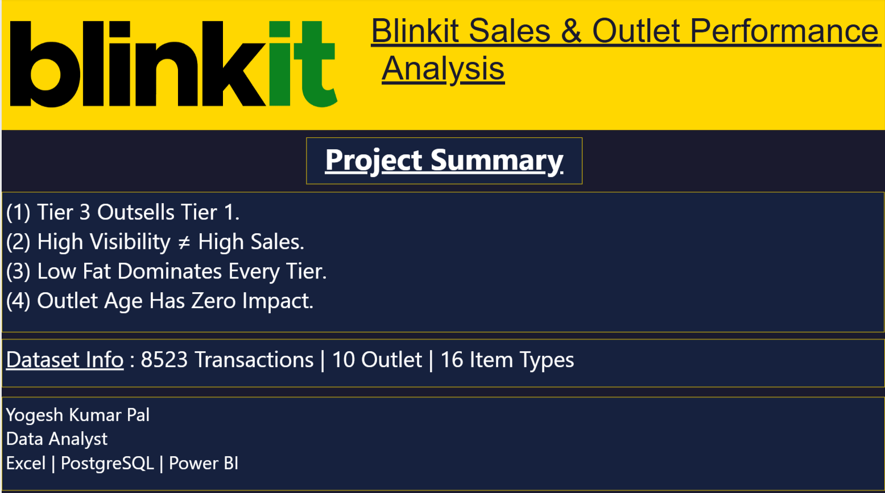
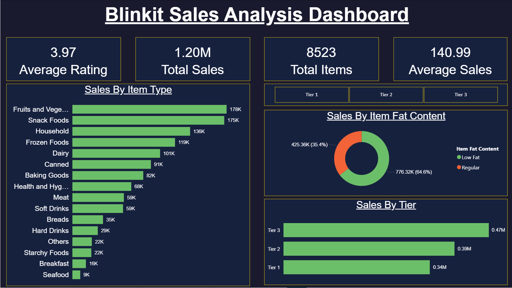
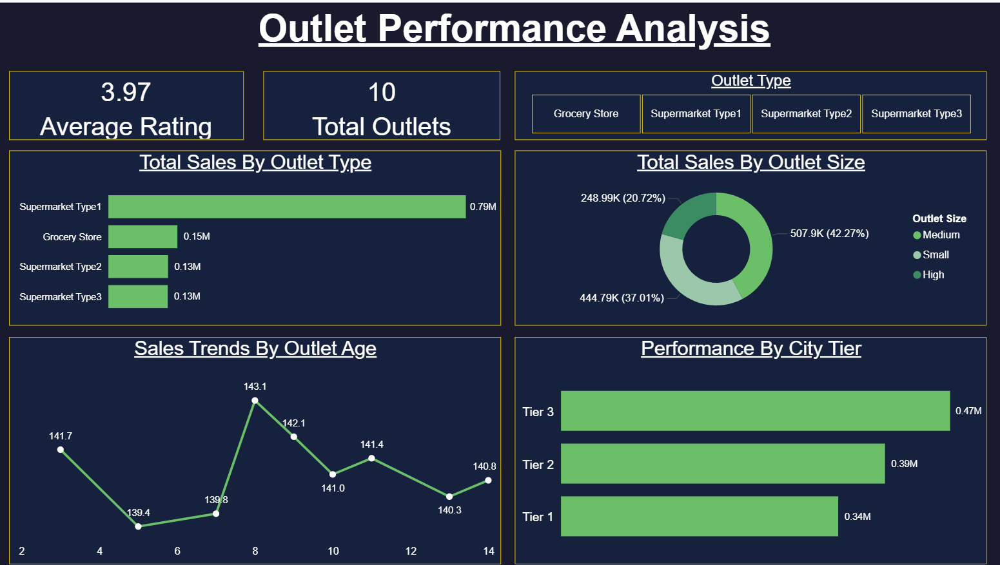
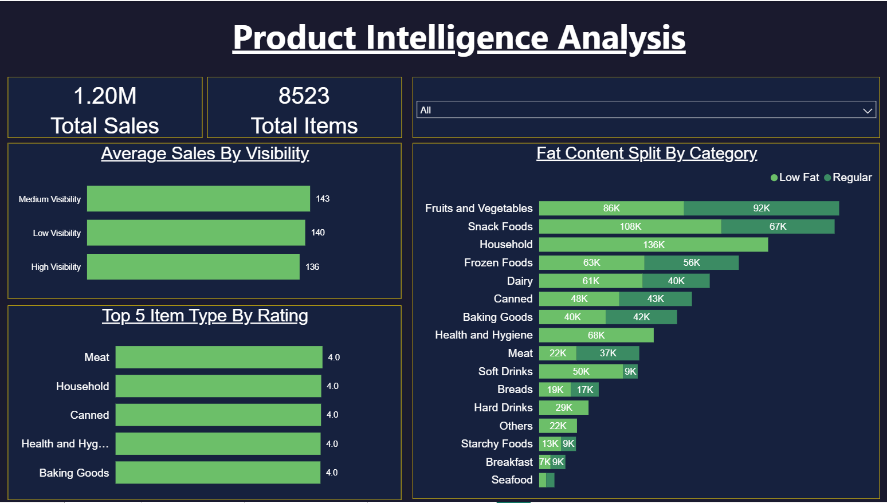

# Blinkit Sales & Outlet Performance Analysis

## Project Overview
An end-to-end data analysis project on Blinkit's grocery sales data covering 
8,523 transactions across 10 outlets and 16 product categories. The project 
follows a complete analyst workflow — data cleaning, SQL analysis, and 
interactive Power BI dashboard.

## Tools Used
- **Excel** — Initial data cleaning and feature engineering
- **PostgreSQL** — Data loading, cleaning and business analysis queries
- **Power BI** — Interactive 4-page dashboard with dark theme

## Dataset
- Source: Kaggle — Blinkit Grocery Dataset
- Rows: 8,523 transactions
- Columns: 13 (including engineered Outlet Age column)

## Data Cleaning Steps
1. Standardised Item Fat Content labels — LF/low fat → Low Fat, reg → Regular
2. Replaced 1,463 null Item Weight values with item-type-wise average weight
3. Replaced 526 zero Item Visibility values with item-type-wise average visibility
4. Engineered Outlet Age column from Outlet Establishment Year

## Business Questions Answered
1. Which product categories generate the most revenue?
2. Do Tier 1 cities outsell Tier 2 and Tier 3?
3. Which outlet type and size performs best?
4. Does outlet age affect sales performance?
5. Do Low Fat products outsell Regular across all tiers?
6. Does higher shelf visibility lead to higher sales?
7. Which individual outlets are top performers?

## Key Findings
1. Fruits & Vegetables and Snack Foods are top revenue drivers reflecting 
   daily essential buying behaviour in quick commerce
2. Tier 3 cities generate highest total revenue (₹472,133) — 
   contradicting the assumption that metros drive most sales
3. All outlet formats have nearly identical avg sales per item (~₹141) — 
   format type does not determine sales efficiency
4. Outlet age has zero impact on sales — Blinkit's operational model 
   is fully standardised across all store ages
5. Low Fat products outsell Regular in every single tier including Tier 3 — 
   health conscious buying is not limited to metro customers
6. High visibility items have the LOWEST avg sales (₹136) — shelf space 
   is allocated to slow movers not bestsellers
7. Small format Supermarket Type1 stores deliver the best sales efficiency

## Dashboard Pages
### 1. Overview — Project summary and key findings

### 2. Sales Overview — Sales by item type, fat content and city tier

### 3. Outlet Performance — Outlet type, size, age and tier analysis

### 4. Product Intelligence — Visibility analysis, ratings and fat content split

## Author
**Yogesh Kumar Pal**

Data Analyst | Excel | PostgreSQL | Power BI
